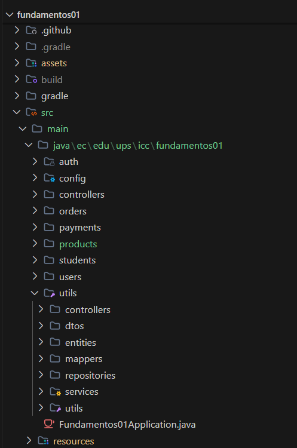
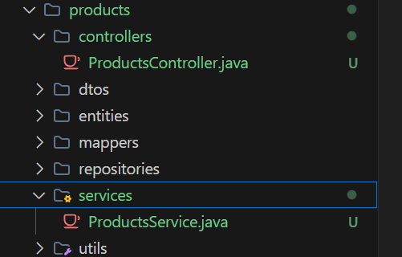
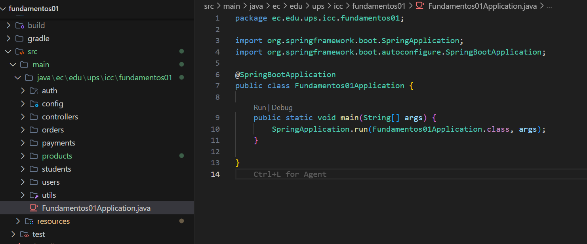
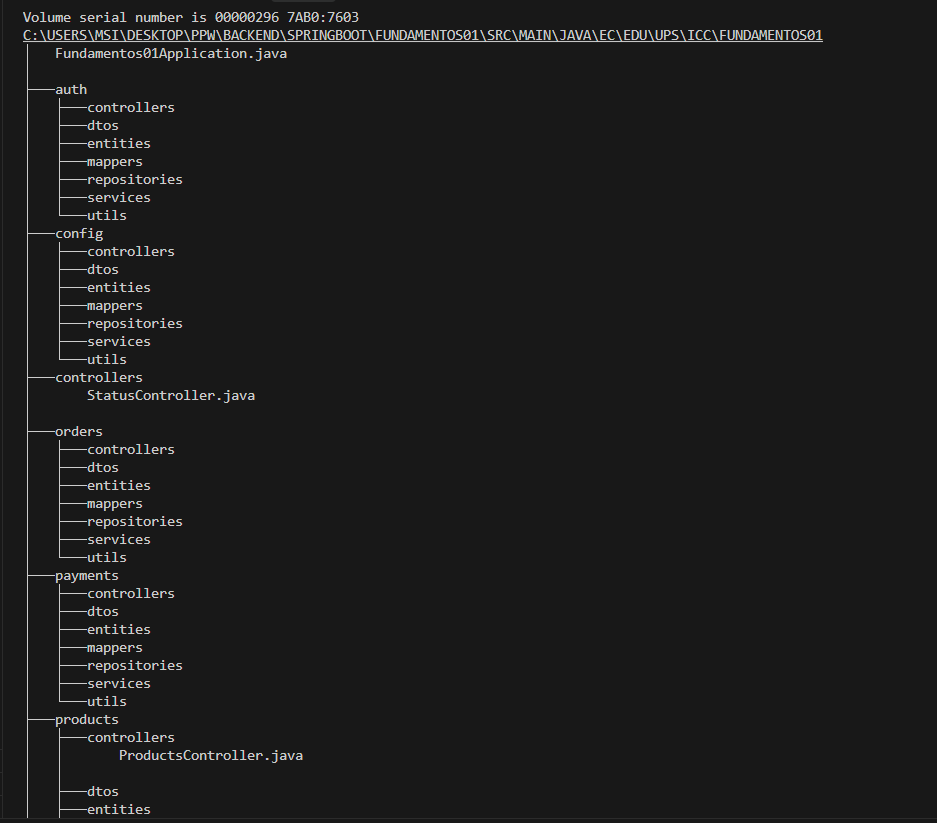
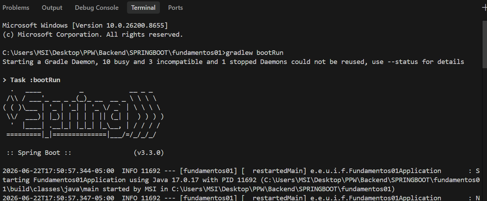

# Programación y Plataformas Web

# Frameworks Backend: Spring Boot – Estructura del Proyecto

<div align="center">
  
</div>


## Práctica 2 (Spring Boot): Estructura del Proyecto, Arquitectura Interna y Organización Modular

### Autores

**Cinthya Ramón**

[cramonm1@ups.edu.ec](mailto:cramonm1@ups.edu.ec)

GitHub: [CinthyLu](https://github.com/CinthyLu)

---

# 1. Estructura Modular del Proyecto en el IDE

Se reorganizó el proyecto de Spring Boot aplicando un diseño modular por dominios dentro del paquete raíz `ec.edu.ups.icc.fundamentos01`. Se crearon los módulos principales (`auth`, `config`, `products`, `users` y `utils`). Adicionalmente, el dominio `products` se dividió internamente en capas de controlador, servicio, repositorio, entidad, DTO y mapeadores.

Para esta práctica se reorganizó el proyecto utilizando una estructura basada en dominios.

```text
src/main/java/ec/edu/ups/icc/fundamentos01/
├── auth/
├── config/
├── controllers/
├── orders/
├── payments/
├── products/
├── students/
├── users/
├── utils/
└── Fundamentos01Application.java
```

---



## 1.1 Organización del Módulo Products

Dentro del módulo `products` se creó la siguiente estructura:

```text
products/
├── controllers/
├── services/
├── repositories/
├── entities/
├── dtos/
├── mappers/
└── utils/
```

Esta organización permite encapsular todas las funcionalidades relacionadas con productos en un único módulo.

---



---

# 2. Ubicación de la Clase Principal y Escaneo de Componentes

La clase principal `Fundamentos01Application.java` se encuentra ubicada directamente en el paquete raíz `ec.edu.ups.icc.fundamentos01`. Al estar anotada con `@SpringBootApplication`, el mecanismo `@ComponentScan` implícito detectará de forma automática todos los componentes (`@RestController`, `@Service`, `@Repository`, etc.) creados dentro de este paquete y sus subpaquetes.



---

# 3. Árbol de Directorios Generado desde Terminal

A continuación se muestra la salida del comando `tree /F` ejecutado en la terminal del sistema, la cual confirma la creación jerárquica de la estructura del proyecto y los archivos iniciales creados (`ProductsController.java` y `ProductsService.java`):

```bash
tree /F src\main\java\ec\edu\ups\icc\fundamentos01
```



---


# 4. Implementación de Clases de Prueba

Con el objetivo de validar el funcionamiento de la estructura modular y del mecanismo de detección automática de Spring Boot, se crearon clases vacías dentro de los paquetes correspondientes.

## ProductsController.java

```java
package ec.edu.ups.icc.fundamentos01.products.controllers;

public class ProductsController {
}
```

## ProductsService.java

```java
package ec.edu.ups.icc.fundamentos01.products.services;

public class ProductsService {
}
```


---

# 5. Ejecución del Proyecto

Para verificar que la reorganización del proyecto no generó errores, se ejecutó la aplicación mediante Gradle.

Comando utilizado:

```bash
gradlew bootRun
```

Al iniciar correctamente, Spring Boot realizó el escaneo de componentes y levantó el servidor embebido Tomcat sin inconvenientes.

---

# 6. Resultados y Evidencias

## 6.1 Estructura Modular del Proyecto en el IDE

La siguiente captura muestra la organización completa del proyecto dentro del IDE.


## 6.2 Ejecución con bootRun

La aplicación se ejecutó correctamente utilizando Gradle.



---

# 7. Análisis y Explicación Breve: ¿Por qué es importante tener módulos separados?

En aplicaciones empresariales es importante organizar el código por módulos o dominios (como `products`, `users` o `auth`) en lugar de agrupar todas las clases por tipo, porque facilita encontrar y mantener la funcionalidad relacionada con cada área del sistema. Dentro de cada módulo, los controladores reciben las solicitudes del usuario, los servicios procesan la lógica de negocio y los repositorios se encargan de acceder a la base de datos. Esta separación permite que cada componente tenga una responsabilidad clara, evita mezclar código de diferentes capas, reduce errores de configuración en Spring Boot y hace que el proyecto sea más fácil de entender, mantener y ampliar a medida que crece.

Además, facilita:

- La reutilización de código.
- El trabajo colaborativo entre desarrolladores.
- La escalabilidad del proyecto.
- La separación adecuada de responsabilidades.

Spring Boot complementa esta organización mediante el uso de `@ComponentScan`, que detecta automáticamente los componentes ubicados dentro del paquete raíz y sus subpaquetes.
