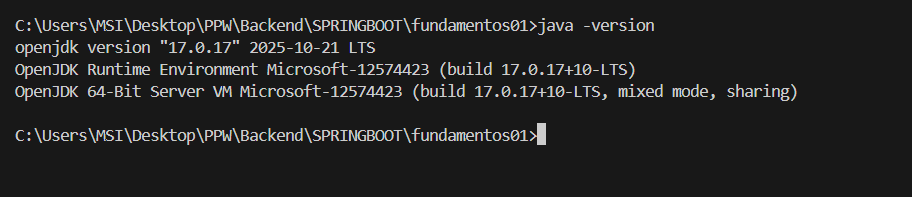
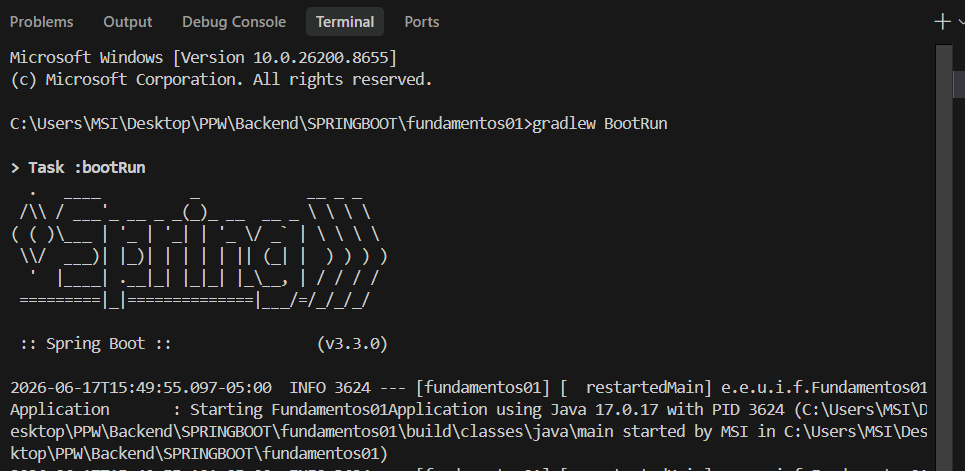
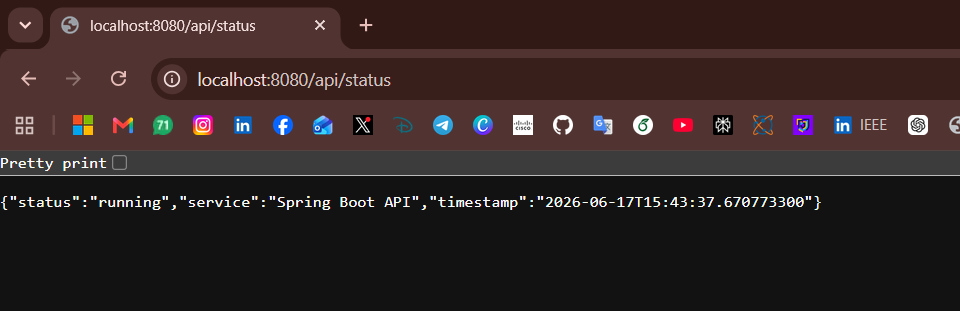
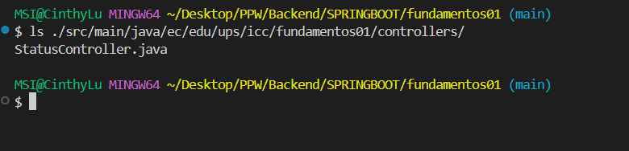

# INFORME DE EVIDENCIAS: PRÁCTICA 01
## Instalación, Configuración Inicial y Primer Endpoint de Spring Boot

**Asignatura:** Programación y Plataformas Web  
**Carrera:** Ingeniería en Ciencias de la Computación  
**Institución:** Universidad Politécnica Salesiana (UPS)  
**Estudiante:** Cinthya Ramón  

---

## 1. Verificación de la Versión de Java

Para realizar esta práctica se configuró **Java 17 (LTS)**. A continuación se muestra la salida del comando `java -version` en la terminal de comandos de Windows:

```bash
java -version
```

### Salida esperada en consola:
```text
openjdk version "17.0.17" 2025-10-21 LTS
OpenJDK Runtime Environment Microsoft-12574423 (build 17.0.17+10-LTS)
OpenJDK 64-Bit Server VM Microsoft-12574423 (build 17.0.17+10-LTS, mixed mode, sharing)
```

### Evidencia Visual:


---

## 2. Servidor Spring Boot Ejecutándose

Se configuraron las dependencias web en `build.gradle` para iniciar el servidor web embebido **Apache Tomcat**. Se inició la aplicación utilizando el wrapper de Gradle:

```bash
./gradlew bootRun
```

### Salida esperada en consola:
El servidor levanta exitosamente en el puerto por defecto `8080` mostrando la inicialización y arranque de Tomcat y la clase principal `DemoApplication`:

```text
:: Spring Boot ::                (v4.1.0)

2026-06-17T01:24:36.709-05:00  INFO 29488 --- [demo] [  restartedMain] o.s.boot.tomcat.TomcatWebServer          : Tomcat initialized with port 8080 (http)
2026-06-17T01:24:36.720-05:00  INFO 29488 --- [demo] [  restartedMain] o.apache.catalina.core.StandardService   : Starting service [Tomcat]
...
2026-06-17T01:24:36.970-05:00  INFO 29488 --- [demo] [  restartedMain] o.s.boot.tomcat.TomcatWebServer          : Tomcat started on port 8080 (http) with context path '/'
2026-06-17T01:24:36.973-05:00  INFO 29488 --- [demo] [  restartedMain] e.e.u.icc.fundamentos01.DemoApplication  : Started DemoApplication in 1.11 seconds
```

### Evidencia Visual:


---

## 3. Verificación del Endpoint `/api/status`

Se implementó el endpoint REST `/api/status` en `StatusController` que expone información en formato JSON. Se comprobó su acceso desde el navegador:

**URL:** `http://localhost:8080/api/status`

### Respuesta JSON devuelta:
```json
{
  "service": "Spring Boot API",
  "status": "running",
  "timestamp": "2026-06-17T01:24:36.973"
}
```

### Evidencia Visual:


---

## 4. Estructura del Controlador en la Terminal

Para demostrar la correcta ubicación física de los archivos fuentes dentro de la estructura de paquetes especificada, se listó el contenido del directorio de controladores usando PowerShell/CMD:

```bash
ls ./src/main/java/ec/edu/ups/icc/fundamentos01/controllers/
```

### Archivo compilado/creado:
* `StatusController.java`

### Evidencia Visual:


---

## 5. Explicación del Funcionamiento y Rol de Spring Boot

### Funcionamiento del Endpoint
El endpoint `/api/status` funciona de la siguiente manera:
1. **Petición del Cliente:** El cliente (navegador) realiza una solicitud HTTP con el método `GET` a la dirección `http://localhost:8080/api/status`.
2. **Mapeo:** La anotación `@GetMapping("/api/status")` intercepta esta llamada indicando que el método `status()` de la clase `StatusController` debe procesarla.
3. **Serialización a JSON:** Gracias a la anotación `@RestController` en la cabecera de la clase, el valor de retorno (un mapa de clave-valor `Map<String, Object>`) se convierte de forma automática a formato JSON (`application/json`) y se envía en el cuerpo de la respuesta HTTP de vuelta al cliente.

### Rol general de Spring Boot en la creación del servidor
* **Servidor Embebido (Tomcat):** Spring Boot facilita el desarrollo web al incluir Tomcat por defecto dentro del empaquetado del proyecto. Esto elimina la necesidad de instalar, configurar y desplegar la aplicación en un servidor de aplicaciones externo de manera manual.
* **Auto-configuración (Opinionated):** Spring Boot detecta de manera inteligente las dependencias en `build.gradle` (como `spring-boot-starter-web`) y auto-configura los componentes necesarios (el despachador de peticiones `DispatcherServlet`, los serializadores JSON Jackson, etc.) sin necesidad de archivos de configuración XML complejos.
* **Inyección de Dependencias y Anotaciones:** Facilita la creación de servicios modulares desacoplados, permitiendo definir controladores HTTP con anotaciones simples como `@RestController` y `@GetMapping`.
